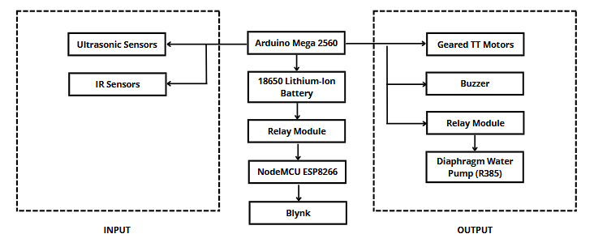
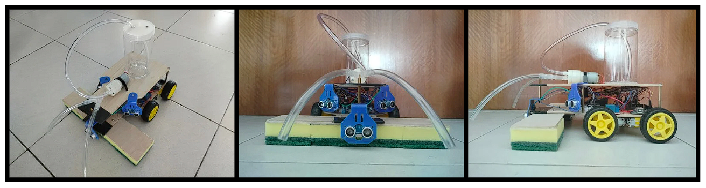

# Automated Sanitation and Cleaning System for Fly Prevention in Cafeterias 🤖🧼

This project is part of my Final Year Project (FYP) at Universiti Teknikal Malaysia Melaka (UTeM). It focuses on developing an automated table-cleaning prototype to enhance cleanliness in cafeterias and help prevent the spread of diseases caused by flies.

## 📌 Project Objective
The following objectives define the primary goals of this project:
- To develop an automated cleaning system that efficiently sanitizes table surfaces in cafeterias to prevent fly attraction and contamination risks.
- To integrate wireless communication using the Blynk mobile application between the automated cleaning system and the user, allowing remote control of system's operations.
- To analyze the performance of the prototype in aspects of cleaning efficiency, obstacle detection accuracy, and operational reliability.

## 🛠️ Components Used
- **Arduino Mega 2560** – main microcontroller
- **Ultrasonic Sensors** – for obstacle avoidance
- **IR Sensor** – for line-following mechanism
- **Motor Driver (L298N)** – to control Geared TT motors
- **Geared TT Motors** – to drive the cleaning system
- **Relay Modules** – controls the diaphragm pump and power of the system
- **Diaphragm Water Pump** – sprays cleaning liquid
- **ESP-01 / NodeMCU** – enables IoT functionality (via Blynk platform)
- **Blynk IoT Platform** – remote control to start/stop the system

## 💡 Key Features
- **Obstacle Detection**: Prevents movement if plates or cups are on the table
- **Liquid Dispensing**: Sprays cleaning liquid on dirty surfaces
- **Line Following**: Follows the black line path to navigate cleaning area
- **IoT Control**: Start/stop the system using Blynk app (mobile-free version)

## 🔲 System Block Diagram

The following block diagram shows the overall working architecture of the prototype system:

## 📌 Pin Configuration Table

| Component             | Connected To        | Pins                              |
|-----------------------|---------------------|-----------------------------------|
| Ultrasonic Sensor 1   | Arduino Mega 2560   | Trigger: 3, Echo: 4               |
| Ultrasonic Sensor 2   | Arduino Mega 2560   | Trigger: 13, Echo: 12             |
| Ultrasonic Sensor 3   | Arduino Mega 2560   | Trigger: 24, Echo: 22             |
| IR Sensor 1           | Arduino Mega 2560   | A0 (Analog)                       |
| IR Sensor 2           | Arduino Mega 2560   | A1 (Analog)                       |
| L298N Motor Driver    | Arduino Mega 2560   | ENA: 5, IN1: 6, IN2: 7, IN3: 8, IN4: 9, ENB: 10 |
| Relay Module (Pump)   | Arduino Mega 2560   | 26                                |
| Buzzer                | Arduino Mega 2560   | 11                                |
| Relay Module (Power)  | NodeMCU / ESP8266   | D1                                |

## 📷 Prototype Image

The final prototype design is built using a compact stacked arrangement that efficiently utilizes vertical space. The internal components are neatly distributed across multiple layers, contributing to better organization and structural balance. The top layer houses the water pump and container, allowing for easy access during refilling without disrupting the overall setup. This layered configuration not only supports stable operation on tabletop surfaces but also helps shield the internal hardware from potential external impacts, offering added protection. The design ensures a clean layout and reliable performance during cleaning tasks.
